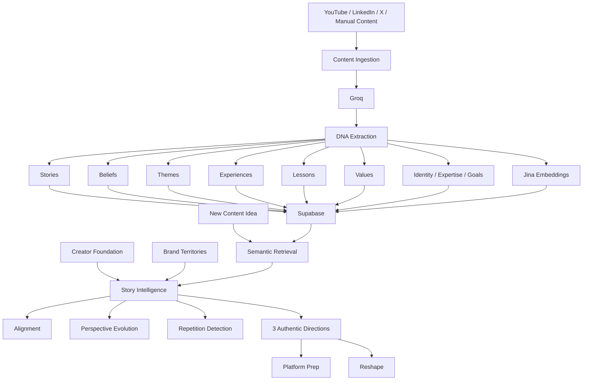

# Creator DNA

### Your content remembers everything, so you don't have to.

**Creator DNA is an AI memory and narrative intelligence layer for creators.**

Most AI content tools start with a blank prompt.

Creator DNA starts with **you** — your past stories, beliefs, experiences, lessons, expertise, and how your perspective has evolved over time.

Instead of asking:

> “What should I post?”

Creator DNA asks:

> **“Given who I've been, what I believe now, and where I want my story to go — what should I say next?”**

🌐 **Live Demo:** https://creator-dna-pi.vercel.app  
💻 **GitHub:** https://github.com/Aishwaryajakka/CreatorDNA

---

## The Problem

Creators produce years of valuable content across YouTube, LinkedIn, X, and other platforms.

But every time they open an AI writing tool, they effectively start over.

Existing AI can imitate tone.

It usually does not understand:

- stories you've already told
- beliefs you've repeated
- beliefs you've changed
- experiences that shaped your perspective
- topics you want to become known for
- ideas you're at risk of repeating
- where your personal narrative is heading

That means creators still have to manually remember their entire body of work every time they plan something new.

**Creator DNA turns that history into memory.**

---

## The Core Idea

> **Don't build an AI that writes like the creator.  
> Build an AI that remembers the creator.**

Creator DNA transforms a creator's historical content into a structured **Creator Story Graph**.

```text
Past Content
     ↓
AI Extraction
     ↓
Creator DNA
     ↓
Stories · Beliefs · Themes · Experiences
Lessons · Values · Goals · Identity · Expertise
     ↓
Semantic Memory
     ↓
New Idea
     ↓
Relevant History + Perspective Evolution
     ↓
3 Authentic Directions
```

---

# What Creator DNA Does

## 1. Import Your Content

Creator DNA can ingest creator history from multiple platforms.

### YouTube

Import existing YouTube videos and turn transcripts/content into Creator DNA.

### LinkedIn

LinkedIn OAuth is connected.

Direct historical post import requires additional LinkedIn API permissions, so creators can currently add LinkedIn posts manually while direct import access is pending.

### X

X OAuth is connected.

Recent-post import depends on available X API access. Manual content addition provides a fallback when direct access is unavailable.

### Manual Content

Creators can also paste any previous content directly into Creator DNA.

---

## 2. Extract Your Creator DNA

Each piece of content is analyzed and converted into meaningful narrative signals.

Creator DNA currently extracts:

- **Stories**
- **Beliefs**
- **Themes**
- **Experiences**
- **Lessons**
- **Values**
- **Goals**
- **Identity**
- **Expertise**

Each signal keeps its provenance so Creator DNA can trace an insight back to the content that produced it.

Example:

```text
BELIEF

"Consistency beats extreme intensity when the game lasts ten years."

Source:
Founder Performance Is a Long Game
2025
```

---

## 3. Build a Story Map

Creator DNA turns extracted memory into a visual **Story Map**.

Instead of looking at content as isolated posts, you can explore how your:

- stories connect to lessons
- experiences shape beliefs
- beliefs reinforce themes
- perspectives evolve
- expertise develops over time

Your content becomes a navigable narrative graph.

---

## 4. Define Your Creator Foundation

Historical content tells Creator DNA **who you've been**.

Creator Foundation tells it **who you believe you are now**.

The Foundation captures information such as:

- identity
- beliefs
- experiences
- values
- expertise
- goals
- current direction

This gives Creator DNA a current reference point when older and newer content disagree.

That disagreement is often the most interesting part.

---

## 5. Choose Your Brand Territories

Creators define the areas they want people to associate with them.

Examples:

```text
Entrepreneurship
Sustainable Ambition
Founder Performance
Long-Term Thinking
```

Brand Territories represent **where the creator wants to go**.

Historical Creator DNA remains the evidence of where they have actually been.

That distinction matters.

---

# Plan Content

This is where Creator DNA's memory becomes useful.

Enter a new idea:

> “I want to create something about working hard as a founder.”

Creator DNA retrieves the most relevant parts of your history and analyzes:

### Relevant Stories

What experiences from your past could make the idea more personal?

### Previous Positions

What have you already said about this subject?

### Perspective Evolution

Has your opinion changed?

### Repetition

Are you about to tell the same story again?

### Alignment

How well does the idea fit your actual Creator DNA?

Alignment uses four states:

```text
Strong
Mixed
Weak
Insufficient evidence
```

No fake “87% authentic” scores.

Creator DNA shows:

- **Why**
- **Watch Out**
- **Opportunity**

---

## Example: Perspective Evolution

Imagine a founder has this history:

```text
2023
"Working 80 hours is the price of success."

2024
Burnout changes their perspective.

2025
"Consistency beats extreme intensity."

2026
"Sustainable ambition is a competitive advantage."
```

They enter:

> “I want to create something about working hard as a founder.”

A generic AI might simply generate productivity advice.

Creator DNA can recognize the tension.

```text
ALIGNMENT

Mixed

WHY

You've historically connected intensity with founder ambition.

WATCH OUT

Your more recent content shows that your position has evolved
toward sustainable performance.

OPPORTUNITY

Make the belief evolution itself the story.
```

That is the difference between generating content and **remembering the creator**.

---

# Three Authentic Directions

Creator DNA doesn't immediately write a generic post.

It first proposes **exactly three directions** grounded in the creator's history.

For each direction, the creator can see the relevant DNA that supports it.

Then they can reshape the direction in three ways:

### Closer to my story

Ground the idea more deeply in real experiences, stories, and lessons.

### Stronger point of view

Clarify the creator's current belief without inventing a fake contrarian position.

### Fresh angle without repeating myself

Find a new framing when the idea is authentic but too similar to something the creator has already said.

---

# Platform-Aware Planning

Creator DNA separates:

**What should I say?**

from:

**How should I express it on this platform?**

The same Creator DNA can support content across platforms.

A YouTube story from 2024 might become evidence for a LinkedIn post in 2026.

Platform selection affects preparation — not authenticity.

### LinkedIn

Creator DNA prepares:

- first-line hook
- personal/professional framing
- structural beats
- point-of-view positioning

### X

Creator DNA prepares:

- concise hook
- single-post vs thread recommendation
- compact argument structure
- sharper framing

### YouTube

Creator DNA prepares:

- title direction
- opening tension
- narrative structure
- talking points

### Threads

Creator DNA prepares:

- conversational opener
- lightweight sequence
- more informal framing

---

# Research Pulse

Creator DNA can also connect a creator's existing story to what is happening in the world.

Instead of showing generic trending topics, Research Pulse asks:

> **“Why does this matter to this particular creator?”**

External research is matched against:

- Brand Territories
- Creator Foundation
- beliefs
- expertise
- themes
- goals

The result is research connected to the creator's existing narrative rather than another generic trend feed.

---

# Architecture



---

# Technology

### Frontend

- React
- TypeScript
- TanStack Router
- Vite
- Tailwind CSS

### Backend & Data

- Supabase
- PostgreSQL
- pgvector
- Row Level Security
- Server-side OAuth/token handling

### AI

**Groq**

Used for structured extraction, narrative reasoning, alignment analysis, and content-direction reasoning.

**Jina AI**

Used for semantic Creator DNA memory and retrieval with:

```text
jina-embeddings-v3
1024-dimensional vectors
```

Stored creator memories use retrieval-oriented embeddings so new ideas can find semantically relevant historical evidence.

**Perplexity**

Used by Research Pulse for current external research and source discovery.

### Deployment

- Vercel
- Supabase

---

# Data Model

At a high level:

```text
User
 │
 ├── Profile
 │
 ├── Creator Foundation
 │
 ├── Brand Territories
 │
 ├── Content Items
 │     │
 │     └── DNA Nodes
 │            │
 │            ├── Story
 │            ├── Belief
 │            ├── Theme
 │            ├── Experience
 │            ├── Lesson
 │            ├── Value
 │            ├── Goal
 │            ├── Identity
 │            └── Expertise
 │
 ├── DNA Edges
 │
 └── Research Connections
```

Every creator's data and semantic retrieval are user-scoped.

---

# Why a Story Graph?

A content calendar answers:

> What am I publishing next?

A Story Map answers:

> What story have I been telling?

Creator DNA is designed around the second question.

Because creators don't only produce posts.

Over time, they build:

- recurring beliefs
- personal mythology
- expertise
- intellectual territory
- evolving perspectives

**Every creator has a content calendar. Creator DNA gives them a story map.**

---

# Local Development

Clone the repository:

```bash
git clone https://github.com/Aishwaryajakka/CreatorDNA.git
cd CreatorDNA
```

Install dependencies:

```bash
npm install
```

Create your environment file:

```bash
cp .env.example .env.local
```

Configure the required environment variables for your local environment.

The application currently uses services including:

```text
Supabase
Groq
Jina AI
Perplexity
YouTube Data API
LinkedIn OAuth
X OAuth
```

Do not expose server-side secrets through client-side environment variables.

Start development:

```bash
npm run dev
```

Build:

```bash
npm run build
```

Type-check:

```bash
npx tsc --noEmit
```

---

# Privacy & Grounding

Creator DNA is intentionally designed around evidence.

The system distinguishes between:

### Historical Evidence

What the creator has actually published.

### Declared Direction

What the creator says they want to become known for.

### External Research

What is currently happening outside the creator's content history.

These sources should not be silently blended together.

Creator DNA also validates retrieved DNA against the authenticated user before using it as personal evidence.

---

# What Creator DNA Is Not

Creator DNA is **not another generic AI post generator**.

The goal is not:

```text
Prompt → polished LinkedIn post
```

The goal is:

```text
Your History
+
Your Current Beliefs
+
Your Direction
+
A New Idea
↓
The most authentic place your story could go next
```

Writing is downstream.

Memory comes first.

---

# Built for the AI Content Engine Hackathon

Creator DNA was built for the **AI Content Engine Hackathon**.

The challenge asks builders to automate meaningful parts of the creator workflow.

Creator DNA focuses on a part of that workflow that is still largely manual:

> **remembering everything you've created before deciding what to create next.**

---

# The Vision

Today, Creator DNA remembers:

- what you've said
- what you've experienced
- what you believe
- how those beliefs changed
- where you want to go next

The longer-term opportunity is a persistent intelligence layer for a creator's entire body of work.

Not just:

> “Write like me.”

But:

> **“Understand the story I'm building.”**

---

## Creator DNA

**Most AI starts with a blank prompt. Creator DNA starts with you.**

Built by [Aishwarya Jakka](https://github.com/Aishwaryajakka)
