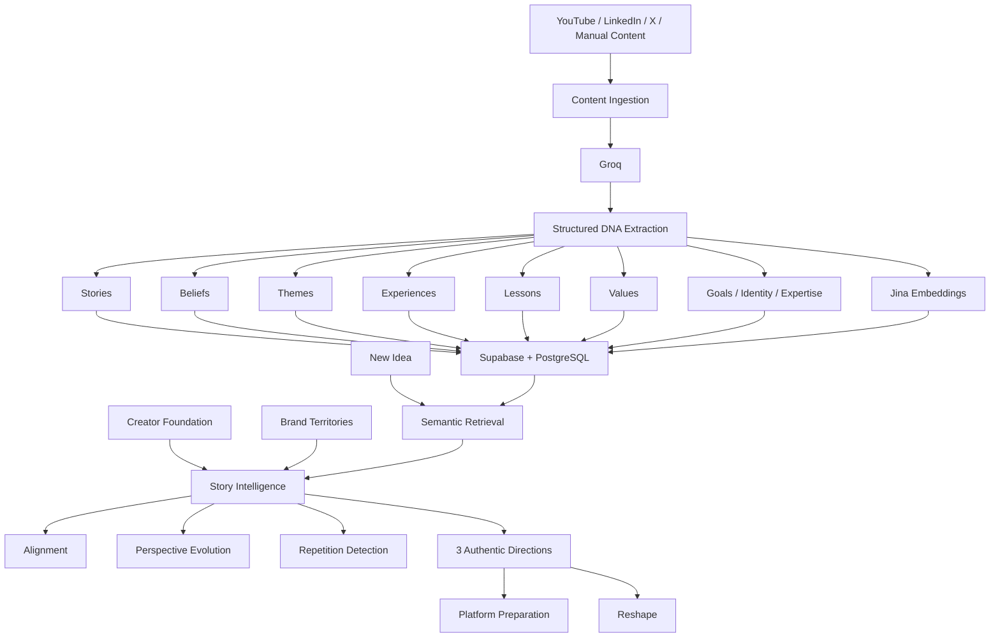

# Creator DNA

### AI memory that helps creators understand their story and decide what to say next.

**Creator DNA is an AI memory and narrative intelligence layer for creators.**

Most AI starts with a blank prompt.

Creator DNA starts with **you** — your past stories, beliefs, experiences, lessons, expertise, and how your perspective has evolved over time.

> **Don't build an AI that writes like the creator. Build an AI that remembers the creator.**

Instead of only asking:

> "What should I post?"

Creator DNA asks:

> **"Given who I've been, what I believe now, and where I want my story to go — what should I say next?"**

**Live Demo:** https://creator-dna-pi.vercel.app <br/>
**GitHub:** https://github.com/Aishwaryajakka/CreatorDNA

---

## Demo Account

Use this pre-seeded account to explore Creator DNA with a complete multi-year creator history.

**Email:** `jordan.creator@example.com`
**Password:** `CreatorDNA!Demo26`

### Best Demo Prompt

Inside **Plan Content**, try:

> **"I want to create something about working hard as a founder."**

Jordan's seeded history evolves from intense hustle culture to burnout, consistency, recovery, and sustainable ambition.

Creator DNA uses that history to surface the evolution in Jordan's beliefs instead of generating generic founder advice.

---

## The Problem

Creators produce years of content across YouTube, LinkedIn, X, and other platforms.

That content contains more than words.

It contains:

* stories they have told
* beliefs they have repeated
* beliefs they have changed
* experiences that shaped their perspective
* lessons they have learned
* expertise they have developed
* topics they want to become known for
* ideas they may already have explored

But when creators open most AI tools, they effectively start over.

The model may understand the current prompt. It may imitate a writing style. But it usually does not understand the creator's larger narrative.

That leaves the creator responsible for remembering their entire body of work every time they decide what to create next.

**Creator DNA turns that history into memory.**

---

## The Core Idea

Creator DNA transforms a creator's historical content into a structured **Creator Story Graph**.

```text
Past Content
     ↓
Structured AI Extraction
     ↓
Creator DNA
     ↓
Stories · Beliefs · Themes · Experiences
Lessons · Values · Goals · Identity · Expertise
     ↓
Semantic Memory
     ↓
New Content Idea
     ↓
Relevant History + Perspective Evolution
     ↓
Alignment + 3 Authentic Directions
```

The goal is not to generate a post as quickly as possible.

The goal is to understand:

> **What is the most authentic place this creator's story could go next?**

---

# How Creator DNA Works

## 1. Import Creator History

Creator DNA can ingest creator content from multiple sources.

### YouTube

Direct YouTube import works end-to-end.

Creators can import existing YouTube content and transform it into structured Creator DNA, including stories, beliefs, themes, experiences, lessons, and expertise.

### LinkedIn

LinkedIn OAuth is connected and working.

Direct historical LinkedIn post import depends on additional LinkedIn API permissions. When direct import is unavailable, creators can manually add LinkedIn content.

### X

X OAuth is connected and working.

Direct post import depends on the level of X API access available to the application. Manual ingestion is available as a fallback.

### Manual Content

Creators can paste existing content directly into Creator DNA.

Regardless of the source, imported content enters the same extraction, embedding, retrieval, and reasoning pipeline.

---

## 2. Extract Creator DNA

Each piece of content is analyzed and converted into structured narrative signals.

Creator DNA currently extracts:

* **Stories**
* **Beliefs**
* **Themes**
* **Experiences**
* **Lessons**
* **Values**
* **Goals**
* **Identity**
* **Expertise**

Each signal preserves its source provenance.

For example:

```text
BELIEF

"Consistency beats extreme intensity when the game lasts ten years."

Source:
Founder Performance Is a Long Game
2025
```

This allows Creator DNA to reason from evidence instead of treating generated interpretations as facts about the creator.

---

## 3. Build a Story Map

Creator DNA transforms extracted memory into a visual **Story Map**.

Instead of treating content as isolated posts, the Story Map helps creators explore how:

* stories connect to lessons
* experiences shape beliefs
* beliefs reinforce themes
* perspectives evolve
* expertise develops over time

A content calendar answers:

> What am I publishing next?

A Story Map answers:

> **What story have I been telling?**

---

## 4. Define the Creator Foundation

Historical content tells Creator DNA **who the creator has been**.

The **Creator Foundation** tells it **who the creator believes they are now**.

It captures information such as:

* identity
* current beliefs
* formative experiences
* values
* expertise
* goals
* current direction

This gives Creator DNA a present-day reference point when older and newer content disagree.

That disagreement is not necessarily a problem.

Sometimes it is the story.

---

## 5. Define Brand Territories

Creators can define the areas they want to become known for.

For example:

```text
Entrepreneurship
Sustainable Ambition
Founder Performance
Long-Term Thinking
```

**Brand Territories** represent where the creator wants to go.

Historical Creator DNA represents where they have actually been.

Creator DNA intentionally keeps these concepts separate so future ambition is not mistaken for historical evidence.

---

# Plan Content

This is where Creator DNA's memory becomes useful.

A creator enters a new idea:

> **"I want to create something about working hard as a founder."**

Creator DNA retrieves relevant memories and evaluates several dimensions.

### Relevant Stories

What experiences from the creator's past could make this idea more personal?

### Previous Positions

What has the creator already said about this subject?

### Perspective Evolution

Has their opinion changed over time?

### Repetition

Is the idea authentic but too similar to something they have already published?

### Alignment

How well does the idea fit the creator's historical DNA, current Foundation, and desired direction?

Creator DNA uses four alignment states:

```text
Strong
Mixed
Weak
Insufficient Evidence
```

Instead of returning an arbitrary authenticity percentage, Creator DNA explains:

* **Why**
* **Watch Out**
* **Opportunity**

---

# Perspective Evolution

Semantic similarity alone is not enough for long-term creator memory.

Consider this history:

```text
2023
"Working 80 hours is the price of success."

2024
Burnout changes the creator's perspective.

2025
"Consistency beats extreme intensity."

2026
"Sustainable ambition is a competitive advantage."
```

Now the creator enters:

> **"I want to create something about working hard as a founder."**

A simple semantic retrieval system may retrieve the 2023 statement because it is highly relevant to the query.

But that does not mean it represents the creator's current belief.

Creator DNA separates three layers:

### Historical Creator DNA

What the creator has actually said and experienced.

### Creator Foundation

What the creator believes about themselves today.

### Brand Territories

Where the creator wants their story to go next.

Instead of treating contradiction as bad data, Creator DNA can recognize it as **perspective evolution**.

The resulting analysis might look like:

```text
ALIGNMENT

Mixed

WHY

You've historically connected intensity with founder ambition.

WATCH OUT

Your more recent content shows that your position has evolved
toward sustainable performance.

OPPORTUNITY

Make the belief evolution itself the story.
```

That is the difference between retrieving related content and **remembering the creator**.

---

# Three Authentic Directions

Creator DNA does not immediately turn every idea into another AI-generated post.

It first proposes **exactly three directions** grounded in the creator's own history.

Each direction can show the Creator DNA evidence supporting it.

The creator can then reshape a direction in three ways:

### Closer to My Story

Ground the direction more deeply in real experiences, stories, and lessons.

### Stronger Point of View

Clarify the creator's current belief without manufacturing a fake contrarian position.

### Fresh Angle Without Repeating Myself

Find a genuinely different framing when an idea is authentic but too similar to something the creator has already published.

---

# Platform-Aware Planning

Creator DNA separates two questions:

> **What should I say?**

from:

> **How should I express it on this platform?**

The underlying creator memory remains the same across platforms.

A YouTube story from 2024 might become evidence for a LinkedIn idea in 2026.

An X post might contain a belief relevant to a future YouTube video.

Platform selection changes how an idea is prepared, not whether the idea is authentic to the creator.

### LinkedIn

Creator DNA can prepare:

* first-line hook
* personal or professional framing
* structural beats
* point-of-view positioning

### X

Creator DNA can prepare:

* concise hook
* single-post or thread recommendation
* compact argument structure
* sharper framing

### YouTube

Creator DNA can prepare:

* title direction
* opening tension
* story structure
* talking points

### Threads

Creator DNA can prepare:

* conversational opener
* lightweight sequence
* informal framing

---

# Research Pulse

Creator DNA can also connect a creator's persistent memory to current external research.

Instead of presenting another generic list of trending topics, Research Pulse asks:

> **"Why does this matter to this particular creator?"**

External research can be matched against:

* Brand Territories
* Creator Foundation
* beliefs
* expertise
* themes
* goals

This connects current events and research to the creator's existing narrative rather than treating trends as isolated content opportunities.

---

# Architecture



---

# Technology

## Frontend

* React
* TypeScript
* TanStack Router
* Vite
* Tailwind CSS

## Backend and Data

* Supabase
* PostgreSQL
* pgvector
* Row Level Security
* server-side authentication
* server-side OAuth token handling

## AI

### Groq

Used for:

* structured Creator DNA extraction
* narrative reasoning
* alignment analysis
* perspective evolution
* repetition analysis
* authentic direction generation

### Jina AI

Used as the semantic memory and retrieval layer.

```text
Model: jina-embeddings-v3
Dimensions: 1024
```

Creator DNA nodes are embedded as semantic memories so new ideas can retrieve relevant beliefs, stories, and experiences even when the wording differs from the creator's original content.

### Perplexity

Used by Research Pulse for external research and source discovery.

## Deployment

* Vercel
* Supabase

---

# Data Model

```text
User
 │
 ├── Profile
 │
 ├── Creator Foundation
 │
 ├── Brand Territories
 │
 ├── Content Items
 │     │
 │     └── DNA Nodes
 │            │
 │            ├── Story
 │            ├── Belief
 │            ├── Theme
 │            ├── Experience
 │            ├── Lesson
 │            ├── Value
 │            ├── Goal
 │            ├── Identity
 │            └── Expertise
 │
 ├── DNA Edges
 │
 └── Research Connections
```

Creator data and semantic retrieval are user-scoped.

---

# Why a Story Graph?

Creators do not just publish posts.

Over time, they build:

* recurring beliefs
* personal stories
* expertise
* intellectual territory
* perspective shifts
* a recognizable narrative

Creator DNA makes those relationships visible.

**Every creator has a content calendar. Creator DNA gives them a story map.**

---

# Privacy and Grounding

Creator DNA is designed around evidence.

The system distinguishes between four sources of context:

### Historical Evidence

What the creator has actually published.

### Creator Foundation

What the creator believes about themselves now.

### Brand Territories

Where the creator wants their story to go.

### External Research

What is currently happening outside the creator's content history.

These sources are intentionally kept distinct.

A future direction should not be treated as evidence of historical authenticity.

External research should not be mistaken for personal experience.

Creator DNA also validates retrieved personal evidence against the authenticated user before using it in reasoning.

---

# Current Platform Support

| Platform | Account Connection | Direct Import                   | Fallback       |
| -------- | ------------------ | ------------------------------- | -------------- |
| YouTube  | Supported          | Working                         | Manual content |
| LinkedIn | OAuth connected    | Pending additional API approval | Manual content |
| X        | OAuth connected    | Depends on approved API access  | Manual content |

Provider connection and Creator DNA memory are intentionally separate.

Connecting an account does not mean Creator DNA claims to have analyzed its history.

Only content that has actually been imported or manually added becomes evidence.

---

# Local Development

Clone the repository:

```bash
git clone https://github.com/Aishwaryajakka/CreatorDNA.git
cd CreatorDNA
```

Install dependencies:

```bash
npm install
```

Create your local environment file:

```bash
cp .env.example .env.local
```

Configure the required environment variables.

Creator DNA currently uses services including:

```text
Supabase
Groq
Jina AI
Perplexity
YouTube Data API
LinkedIn OAuth
X OAuth
```

Keep server-side credentials server-side.

Start development:

```bash
npm run dev
```

Type-check:

```bash
npx tsc --noEmit
```

Build:

```bash
npm run build
```

---

# What Creator DNA Is Not

Creator DNA is **not another generic AI post generator**.

The goal is not:

```text
Prompt
   ↓
Polished LinkedIn Post
```

The goal is:

```text
Your History
      +
Your Experiences
      +
Your Current Beliefs
      +
Your Direction
      +
A New Idea
      ↓
The most authentic place your story could go next
```

Writing is downstream.

**Memory comes first.**

---

# The Vision

Today, Creator DNA remembers:

* what you've said
* what you've experienced
* what you believe
* how those beliefs have changed
* what you're becoming known for
* where you want your story to go next

The longer-term opportunity is a persistent intelligence layer across a creator's entire body of work.

Not just:

> "Write like me."

But:

> **"Understand the story I'm building."**

---

# Creator DNA

### Your content remembers everything, so you don't have to.

**Most AI starts with a blank prompt. Creator DNA starts with you.**

**Live Demo:** https://creator-dna-pi.vercel.app

**Demo Login**

Email: `jordan.creator@example.com`
Password: `CreatorDNA!Demo26`

Built by [Aishwarya Jakka](https://github.com/Aishwaryajakka)
