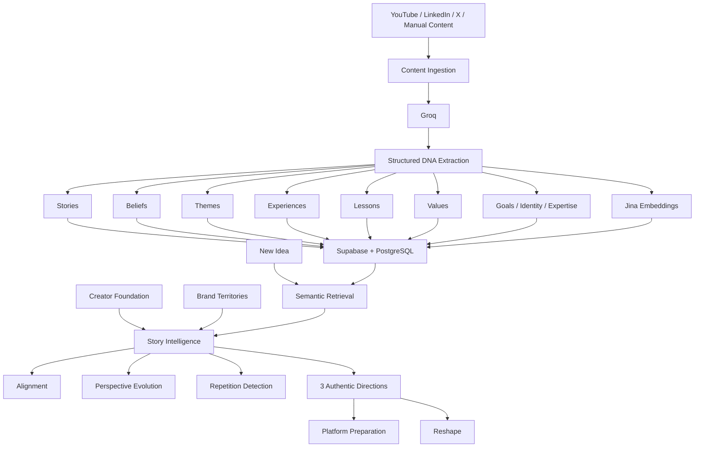

# Creator DNA

### Your content remembers everything, so you don't have to.

**Creator DNA is an AI memory and narrative intelligence layer for creators.**

Most AI starts with a blank prompt.

Creator DNA starts with **you** — your past stories, beliefs, experiences, lessons, expertise, and how your perspective has evolved over time.

> **Don't build an AI that writes like the creator.  
> Build an AI that remembers the creator.**

Instead of asking:

> “What should I post?”

Creator DNA asks:

> **“Given who I've been, what I believe now, and where I want my story to go — what should I say next?”**

🚀 **Try Creator DNA:** https://creator-dna-pi.vercel.app  
💻 **GitHub:** https://github.com/Aishwaryajakka/CreatorDNA

---

## Demo Account

Use this pre-seeded account to explore Creator DNA with a complete multi-year creator history.

**Email:** `jordan.creator@example.com`  
**Password:** `CreatorDNA!Demo26`

The demo account includes:

- YouTube, LinkedIn, and X content history
- Creator Foundation
- Brand Territories
- Story Map
- Jina-powered semantic retrieval
- Plan Content
- Alignment
- Reshape
- Research Pulse

### Best demo prompt

Try this inside **Plan Content**:

> **“I want to create something about working hard as a founder.”**

Jordan's history evolves from intense hustle culture to burnout, consistency, recovery, and sustainable ambition — so Creator DNA can surface the belief evolution instead of generating generic founder advice.

---

## The Problem

Creators produce years of valuable content across YouTube, LinkedIn, X, and other platforms.

But every time they open an AI writing tool, they effectively start over.

Existing AI can imitate tone.

It usually does not understand:

- stories you've already told
- beliefs you've repeated
- beliefs you've changed
- experiences that shaped your perspective
- topics you want to become known for
- ideas you're at risk of repeating
- where your personal narrative is heading

That means creators still have to manually remember their entire body of work every time they plan something new.

**Creator DNA turns that history into memory.**

---

## The Core Idea

Creator DNA transforms a creator's historical content into a structured **Creator Story Graph**.

```text
Past Content
     ↓
AI Extraction
     ↓
Creator DNA
     ↓
Stories · Beliefs · Themes · Experiences
Lessons · Values · Goals · Identity · Expertise
     ↓
Semantic Memory
     ↓
New Idea
     ↓
Relevant History + Perspective Evolution
     ↓
Alignment + 3 Authentic Directions
```

The goal is not to generate a post as quickly as possible.

The goal is to understand:

> **What is the most authentic place this creator's story could go next?**

---

# What Creator DNA Does

## 1. Import Your Content

Creator DNA can ingest creator history from multiple platforms.

### YouTube

Direct YouTube import works today.

Creators can import existing YouTube content and turn it into Creator DNA — including stories, beliefs, themes, experiences, lessons, and expertise.

### LinkedIn

LinkedIn OAuth is connected and working.

Direct historical LinkedIn post import depends on additional LinkedIn API permissions that are still pending provider approval.

For now, creators can manually add LinkedIn posts into Creator DNA.

### X

X OAuth is connected and working.

Direct recent-post import depends on the level of X API access approved for the application.

When direct import is unavailable, creators can manually add X content.

Once content is added — whether through YouTube direct import or manual LinkedIn/X ingestion — the same Creator DNA pipeline runs end-to-end.

### Manual Content

Creators can also paste any previous content directly into Creator DNA.

---

## 2. Extract Your Creator DNA

Each piece of content is analyzed and converted into meaningful narrative signals.

Creator DNA currently extracts:

- **Stories**
- **Beliefs**
- **Themes**
- **Experiences**
- **Lessons**
- **Values**
- **Goals**
- **Identity**
- **Expertise**

Each signal keeps its provenance so Creator DNA can trace an insight back to the content that produced it.

Example:

```text
BELIEF

"Consistency beats extreme intensity when the game lasts ten years."

Source:
Founder Performance Is a Long Game
2025
```

This makes Creator DNA evidence-backed instead of purely generative.

---

## 3. Build a Story Map

Creator DNA turns extracted memory into a visual **Story Map**.

Instead of looking at content as isolated posts, creators can explore how:

- stories connect to lessons
- experiences shape beliefs
- beliefs reinforce themes
- perspectives evolve
- expertise develops over time

A creator's content becomes a navigable narrative graph.

A content calendar answers:

> What am I publishing next?

A Story Map answers:

> **What story have I been telling?**

---

## 4. Define Your Creator Foundation

Historical content tells Creator DNA **who you've been**.

Creator Foundation tells it **who you believe you are now**.

The Foundation captures information such as:

- identity
- beliefs
- formative experiences
- values
- expertise
- goals
- current direction

This gives Creator DNA a current reference point when older and newer content disagree.

That disagreement is often where the most interesting story is.

---

## 5. Choose Your Brand Territories

Creators define the areas they want people to associate with them.

For example:

```text
Entrepreneurship
Sustainable Ambition
Founder Performance
Long-Term Thinking
```

Brand Territories represent **where the creator wants to go**.

Historical Creator DNA remains the evidence of where they have actually been.

Creator DNA intentionally keeps those two things separate.

---

# Plan Content

This is where Creator DNA's memory becomes useful.

A creator enters a new idea:

> “I want to create something about working hard as a founder.”

Creator DNA retrieves the most relevant parts of their history and analyzes:

### Relevant Stories

What experiences from the creator's past could make this idea more personal?

### Previous Positions

What has the creator already said about this subject?

### Perspective Evolution

Has their opinion changed over time?

### Repetition

Is this authentic, but too similar to something they've already published?

### Alignment

How well does the idea fit the creator's actual DNA and current direction?

Alignment uses four states:

```text
Strong
Mixed
Weak
Insufficient evidence
```

No arbitrary authenticity percentages.

Creator DNA explains:

- **Why**
- **Watch Out**
- **Opportunity**

---

## Example: Perspective Evolution

Imagine a founder has this history:

```text
2023
"Working 80 hours is the price of success."

2024
Burnout changes their perspective.

2025
"Consistency beats extreme intensity."

2026
"Sustainable ambition is a competitive advantage."
```

They enter:

> “I want to create something about working hard as a founder.”

A generic AI might simply generate productivity advice.

Creator DNA can recognize the tension.

```text
ALIGNMENT

Mixed

WHY

You've historically connected intensity with founder ambition.

WATCH OUT

Your more recent content shows that your position has evolved
toward sustainable performance.

OPPORTUNITY

Make the belief evolution itself the story.
```

That is the difference between generating content and **remembering the creator**.

---

# Three Authentic Directions

Creator DNA doesn't immediately write a generic post.

It first proposes **exactly three directions** grounded in the creator's history.

For each direction, the creator can see the Creator DNA that supports it.

Then they can reshape the direction in three ways:

### Closer to my story

Ground the idea more deeply in real experiences, stories, and lessons.

### Stronger point of view

Clarify the creator's current belief without inventing a fake contrarian position.

### Fresh angle without repeating myself

Find a genuinely different framing when the idea is authentic but too similar to something the creator has already said.

---

# Platform-Aware Planning

Creator DNA separates:

> **What should I say?**

from:

> **How should I express it on this platform?**

The same Creator DNA can support content across platforms.

A YouTube story from 2024 might become evidence for a LinkedIn post in 2026.

An X post might become evidence for a YouTube idea.

Platform selection affects preparation — not authenticity.

### LinkedIn

Creator DNA prepares:

- strong first-line hook
- personal/professional framing
- structural beats
- point-of-view positioning

### X

Creator DNA prepares:

- concise hook
- single-post vs thread recommendation
- compact argument structure
- sharper framing

### YouTube

Creator DNA prepares:

- title direction
- opening tension
- story structure
- talking points

### Threads

Creator DNA prepares:

- conversational opener
- lightweight sequence
- more informal framing

---

# Research Pulse

Creator DNA can also connect a creator's existing story to what is happening in the world.

Instead of showing generic trending topics, Research Pulse asks:

> **“Why does this matter to this particular creator?”**

External research is matched against:

- Brand Territories
- Creator Foundation
- beliefs
- expertise
- themes
- goals

The result is research connected to the creator's existing narrative instead of another generic trend feed.

---

# Architecture



---

# Technology

## Frontend

- React
- TypeScript
- TanStack Router
- Vite
- Tailwind CSS

## Backend & Data

- Supabase
- PostgreSQL
- pgvector
- Row Level Security
- server-side authentication
- server-side OAuth token handling

## AI

### Groq

Used for:

- structured Creator DNA extraction
- narrative reasoning
- alignment analysis
- perspective evolution
- repetition analysis
- authentic direction generation

### Jina AI

Used for semantic Creator DNA memory and retrieval.

```text
Model:
jina-embeddings-v3

Dimensions:
1024
```

Creator DNA nodes are embedded as semantic memories so a new idea can retrieve relevant evidence from years of historical content.

### Perplexity

Used by Research Pulse for current external research and source discovery.

## Deployment

- Vercel
- Supabase

---

# Data Model

```text
User
 │
 ├── Profile
 │
 ├── Creator Foundation
 │
 ├── Brand Territories
 │
 ├── Content Items
 │     │
 │     └── DNA Nodes
 │            │
 │            ├── Story
 │            ├── Belief
 │            ├── Theme
 │            ├── Experience
 │            ├── Lesson
 │            ├── Value
 │            ├── Goal
 │            ├── Identity
 │            └── Expertise
 │
 ├── DNA Edges
 │
 └── Research Connections
```

Every creator's data and semantic retrieval are user-scoped.

---

# Why a Story Graph?

Creators do not only publish posts.

Over time, they build:

- recurring beliefs
- personal mythology
- expertise
- intellectual territory
- perspective shifts
- a recognizable narrative

Creator DNA makes those relationships visible.

**Every creator has a content calendar. Creator DNA gives them a story map.**

---

# Current Platform Support

| Platform | Account Connection | Direct Import | Current Fallback |
| --- | --- | --- | --- |
| YouTube | Supported | ✅ Working | Manual Add Content |
| LinkedIn | ✅ OAuth connected | Pending additional LinkedIn API approval | Manual Add Content |
| X | ✅ OAuth connected | Depends on approved X API access | Manual Add Content |

Provider connection and Creator DNA memory are intentionally separate.

Connecting an account does not mean Creator DNA claims to have analyzed its history.

Only content that has actually been imported or manually added becomes evidence.

---

# Privacy & Grounding

Creator DNA is intentionally designed around evidence.

The system distinguishes between:

### Historical Evidence

What the creator has actually published.

### Creator Foundation

What the creator believes about themselves now.

### Brand Territories

Where the creator wants their story to go.

### External Research

What is currently happening outside the creator's content history.

These sources are intentionally kept distinct.

A future direction should not be treated as proof of historical authenticity, and external research should not be mistaken for personal experience.

Creator DNA also validates retrieved personal evidence against the authenticated user before using it in reasoning.

---

# Local Development

Clone the repository:

```bash
git clone https://github.com/Aishwaryajakka/CreatorDNA.git
cd CreatorDNA
```

Install dependencies:

```bash
npm install
```

Create your environment file:

```bash
cp .env.example .env.local
```

Configure the required environment variables.

Creator DNA currently uses services including:

```text
Supabase
Groq
Jina AI
Perplexity
YouTube Data API
LinkedIn OAuth
X OAuth
```

Keep server-side credentials server-side.

Start development:

```bash
npm run dev
```

Type-check:

```bash
npx tsc --noEmit
```

Build:

```bash
npm run build
```

---

# What Creator DNA Is Not

Creator DNA is **not another generic AI post generator**.

The goal is not:

```text
Prompt
→ polished LinkedIn post
```

The goal is:

```text
Your History
+
Your Experiences
+
Your Current Beliefs
+
Your Direction
+
A New Idea
↓
The most authentic place your story could go next
```

Writing is downstream.

**Memory comes first.**

---

# Built for the AI Content Engine Hackathon

Creator DNA was built for the **AI Content Engine Hackathon**.

It focuses on a part of the creator workflow that is still surprisingly manual:

> **Remembering everything you've created before deciding what to create next.**

---

# The Vision

Today, Creator DNA remembers:

- what you've said
- what you've experienced
- what you believe
- how those beliefs changed
- what you're becoming known for
- where you want your story to go next

The longer-term opportunity is a persistent intelligence layer across a creator's entire body of work.

Not just:

> “Write like me.”

But:

> **“Understand the story I'm building.”**

---

## Creator DNA

### Your content remembers everything, so you don't have to.

**Most AI starts with a blank prompt. Creator DNA starts with you.**

🚀 **Try Creator DNA:** https://creator-dna-pi.vercel.app

**Demo login**  
Email: `jordan.creator@example.com`  
Password: `CreatorDNA!Demo26`

Built by [Aishwarya Jakka](https://github.com/Aishwaryajakka)
